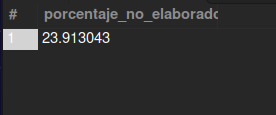

# Evaluación de Base de Datos para Pizzería

## Descripción del Proyecto
Este proyecto diseña una base de datos para gestionar eficientemente los productos, combos, pedidos y clientes de una pizzería. Incluye pizzas, panzarottis, bebidas, postres, adiciones y combos, con soporte para pedidos personalizados para consumir en el lugar o recoger.

## Características Principales
- **Gestión de Productos**: Registro de productos con ingredientes.
- **Gestión de Adiciones**: Adiciones extra a productos.
- **Gestión de Combos**: Grupos de productos a precio especial.
- **Gestión de Pedidos**: Pedidos con personalizaciones.
- **Gestión del Menú**: Disponibilidad de productos y combos.

## Modelo Lógico
Ver `modelo_logico.md` para detalles de entidades, atributos, relaciones y cardinalidades.

## Modelo Físico
Ver `schema.sql` para el esquema DDL de MySQL.

## Diagrama ER (Texto)

## Evidencia
- **Diagrama Visual**: Para un diagrama visual, usa herramientas como drawSQL o StarUML. Por ejemplo, en drawSQL, crea las tablas con las relaciones mostradas arriba. Una captura de pantalla o enlace puede ser proporcionada si se genera.
- **Implementación**: El esquema en `schema.sql` puede ejecutarse en MySQL Workbench para crear la base de datos.

## Tecnologías
- Base de Datos: MySQL
- Lenguaje: SQL
- Herramientas: MySQL Workbench, drawSQL para diagramas

## Instalación y Uso
1. Instala MySQL.
2. Ejecuta `schema.sql` en MySQL para crear la base de datos.
3. Ejecuta `datos_prueba.sql` para insertar datos de prueba.
4. Usa consultas SQL para gestionar datos (ej. INSERT, SELECT).

## Consultas Analíticas
1. **Productos más vendidos (pizza, panzarottis, bebidas, etc.)**: `SELECT p.tipo, p.nombre, SUM(pl.cantidad) AS total_vendido FROM Producto p JOIN Pedido_Linea pl ON p.id_producto = pl.id_producto GROUP BY p.tipo, p.nombre ORDER BY total_vendido DESC;
`

2. **Total de ingresos generados por cada combo**: `SELECT c.nombre AS combo, SUM(cp.cantidad * c.precio) AS ingresos
FROM Pedido_Linea pl
JOIN Combo_Producto cp ON pl.id_producto = cp.id_producto
JOIN Combo c ON cp.id_combo = c.id_combo
GROUP BY c.nombre;
` 

3. **Pedidos realizados para recoger vs. comer en la pizzería**: `SELECT tipo, COUNT(*) AS total_pedidos
FROM Pedido
GROUP BY tipo;
`

4. **Adiciones más solicitadas en pedidos personalizados**: `SELECT a.nombre, COUNT(*) AS veces_solicitada
FROM Pedido_Linea_Adicion pla
JOIN Adicion a ON pla.id_adicion = a.id_adicion
GROUP BY a.nombre
ORDER BY veces_solicitada DESC;
`

5. **Cantidad total de productos vendidos por categoría**: `SELECT p.tipo, SUM(pl.cantidad) AS total_vendidos
FROM Pedido_Linea pl
JOIN Producto p ON pl.id_producto = p.id_producto
GROUP BY p.tipo;
`

6. **Promedio de pizzas pedidas por cliente**: `SELECT c.nombre, AVG(pl.cantidad) AS promedio_pizzas
FROM Pedido_Linea pl
JOIN Pedido pe ON pl.id_pedido = pe.id_pedido
JOIN Cliente c ON pe.id_cliente = c.id_cliente
JOIN Producto p ON pl.id_producto = p.id_producto
WHERE p.tipo = 'pizza'
GROUP BY c.nombre;
`

7. **Total de ventas por día de la semana**: `SELECT DAYNAME(fecha_hora) AS dia_semana, SUM(pl.cantidad * pl.precio_unitario) AS total_ventas
FROM Pedido_Linea pl
JOIN Pedido p ON pl.id_pedido = p.id_pedido
GROUP BY dia_semana
ORDER BY FIELD(dia_semana, 'Monday','Tuesday','Wednesday','Thursday','Friday','Saturday','Sunday');
`

8. **Cantidad de panzarottis vendidos con extra queso**: `SELECT SUM(pl.cantidad) AS total_panzarottis_extra
FROM Pedido_Linea pl
JOIN Producto p ON pl.id_producto = p.id_producto
JOIN Pedido_Linea_Adicion pla ON pl.id_pedido = pla.id_pedido AND pl.id_linea = pla.id_linea
JOIN Adicion a ON pla.id_adicion = a.id_adicion
WHERE p.tipo = 'panzarotti' AND a.nombre LIKE '%Queso%';
`

9. **Pedidos que incluyen bebidas como parte de un combo**: `SELECT DISTINCT pl.id_pedido
FROM Pedido_Linea pl
JOIN Combo_Producto cp ON pl.id_producto = cp.id_producto
JOIN Producto p ON cp.id_producto = p.id_producto
WHERE p.tipo = 'bebida';
`

10. **Clientes que han realizado más de 5 pedidos en el último mes**: `SELECT c.nombre, COUNT(*) AS total_pedidos
FROM Pedido p
JOIN Cliente c ON p.id_cliente = c.id_cliente
WHERE p.fecha_hora >= DATE_SUB(CURDATE(), INTERVAL 1 MONTH)
GROUP BY c.nombre
HAVING total_pedidos > 5;
`

11. **Ingresos totales generados por productos no elaborados (bebidas, postres, etc.)**: `SELECT SUM(pl.cantidad * pl.precio_unitario) AS ingresos_no_elaborados
FROM Pedido_Linea pl
JOIN Producto p ON pl.id_producto = p.id_producto
WHERE p.tipo IN ('bebida','postre','otro');
`

12. **Promedio de adiciones por pedido**: `SELECT AVG(adiciones_por_pedido) AS promedio_adiciones
FROM (
    SELECT id_pedido, COUNT(*) AS adiciones_por_pedido
    FROM Pedido_Linea_Adicion
    GROUP BY id_pedido
) t;
`

13. **Total de combos vendidos en el último mes**: ``

14. **Clientes con pedidos tanto para recoger como para consumir en el lugar**: `SELECT c.nombre
FROM Pedido p
JOIN Cliente c ON p.id_cliente = c.id_cliente
GROUP BY c.nombre
HAVING COUNT(DISTINCT p.tipo) = 2;
`

15. **Total de productos personalizados con adiciones**: `SELECT COUNT(DISTINCT id_pedido, id_linea) AS total_personalizados
FROM Pedido_Linea_Adicion;
`

16. **Pedidos con más de 3 productos diferentes**: `SELECT id_pedido
FROM Pedido_Linea
GROUP BY id_pedido
HAVING COUNT(DISTINCT id_producto) > 3;
`

17. **Promedio de ingresos generados por día**: `SELECT AVG(total_diario) AS promedio_diario
FROM (
    SELECT DATE(p.fecha_hora) AS fecha, SUM(pl.cantidad * pl.precio_unitario) AS total_diario
    FROM Pedido_Linea pl
    JOIN Pedido p ON pl.id_pedido = p.id_pedido
    GROUP BY DATE(p.fecha_hora)
) t;
 `

 

18. **Clientes que han pedido pizzas con adiciones en más del 50% de sus pedidos**: `SELECT c.nombre
FROM Cliente c
JOIN Pedido p ON c.id_cliente = p.id_cliente
JOIN Pedido_Linea pl ON p.id_pedido = pl.id_pedido
JOIN Producto prod ON pl.id_producto = prod.id_producto
LEFT JOIN Pedido_Linea_Adicion pla ON pl.id_pedido = pla.id_pedido AND pl.id_linea = pla.id_linea
WHERE prod.tipo = 'pizza'
GROUP BY c.nombre
HAVING SUM(CASE WHEN pla.id_adicion IS NOT NULL THEN 1 ELSE 0 END) / COUNT(DISTINCT p.id_pedido) > 0.5;
`

19. **Porcentaje de ventas provenientes de productos no elaborados**: `SELECT 
    (SUM(CASE WHEN p.tipo IN ('bebida','postre','otro') THEN pl.cantidad * pl.precio_unitario ELSE 0 END) /
     SUM(pl.cantidad * pl.precio_unitario)) * 100 AS porcentaje_no_elaborados
FROM Pedido_Linea pl
JOIN Producto p ON pl.id_producto = p.id_producto;
`

20. **Día de la semana con mayor número de pedidos para recoger**: `SELECT DAYNAME(fecha_hora) AS dia_semana, COUNT(*) AS total
FROM Pedido
WHERE tipo = 'recoger'
GROUP BY dia_semana
ORDER BY total DESC
LIMIT 1;
`

